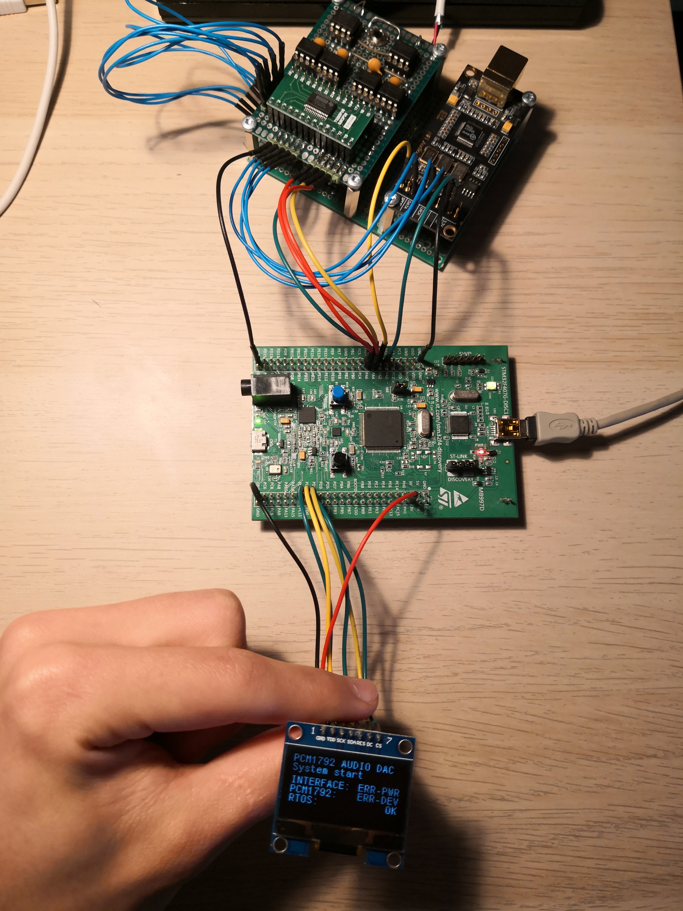

# Library note:

Make sure to just copy parts of the main functions as depending on the processor, your main might be different.
Therefore part before main while loop and inside it is important. Also include at the beginning of the file,
where you have to include external library provided in this folder.

Also make sure to link new library folder in project settings. How to do that is described in VIDEO 25.

## Images
These are images that I used in the video. They should be used as a reference.
